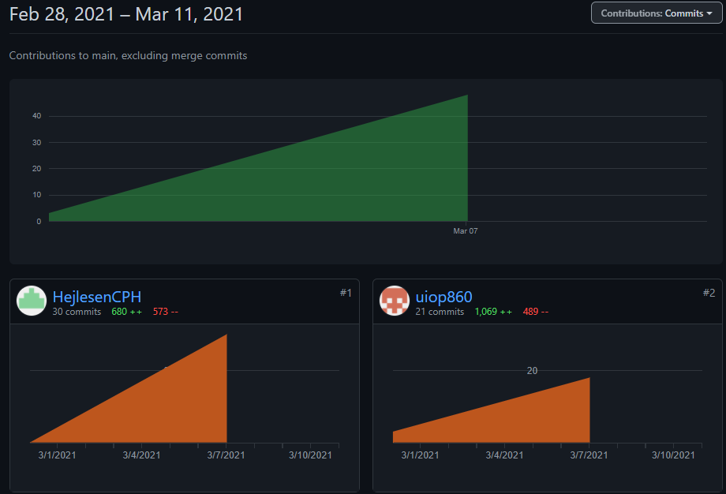

# Flow2 chat assignment

## Short descriptions of final product

#### This chat program has two main classes a chat server and a chat client.

#### The server includes the following classes: Clientservermain,Clienthandler,Messagehandler and Server. 

* **ChatServermain** initializes the serverclass and calls runserver.

* **Server** creates a construtor for the server and have the runServer method in body - the runServer method initializes the clienthandler, and call a new thread everytime a new client logs in to the system. 

* **ClientHandler** run the userinput for each clienthandler thread connect to the system, and initializes the MessageHandler to handle the incomming trafic. The Clienthandler also throws exceptions with illegal outputs 

* **Messagehandler** spilts the command/arguments/message and direct the message to the right person.

#### Client
* **ChatClientMain** opens the connection to the server on either the default port of 2345 and ip "localhost". Or on arguments specified when calling the main class.
* **Client** handles input from the user and sends it to the user. This call also spawns a thread that listens for output from the server.
* **ServerReader** is the thread that is spawned from Client and listens to what the sever sends.

#### Testclass
* **ClientHandlerTest**  starts up its own server to do the test of the code.
* **MyRunnable** runs a simple test input and response.

## Who has done what
Vi har hver dag mødtes kl 9:00, hvor vi har været på opkald med hinanden og snakket omkring opgaven. Vi kan se ud fra 
commit historikken at alle er enten fra Sebastian eller Oliver. Det betyder ikke at Rasmus ikke har lavet 
noget. Rasmus har været rigtig god til at at hjælpe hvis man er kørt fast og ikke kan komme videre. Jeg kan ikke 
fortælle hvad Thias har lavet, da jeg ikke ved det.
